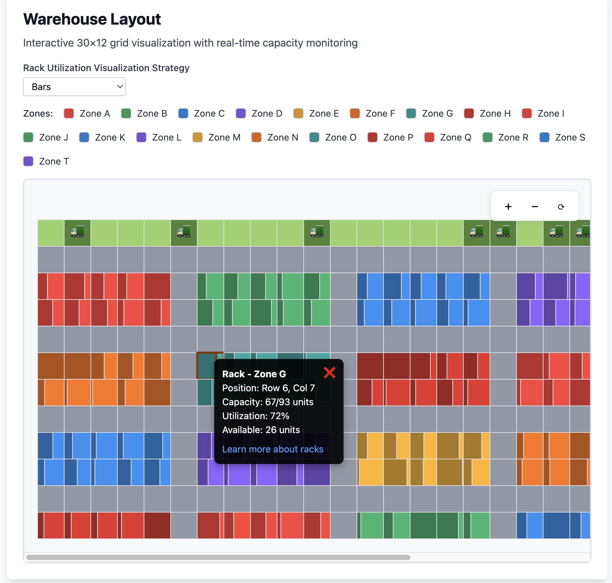
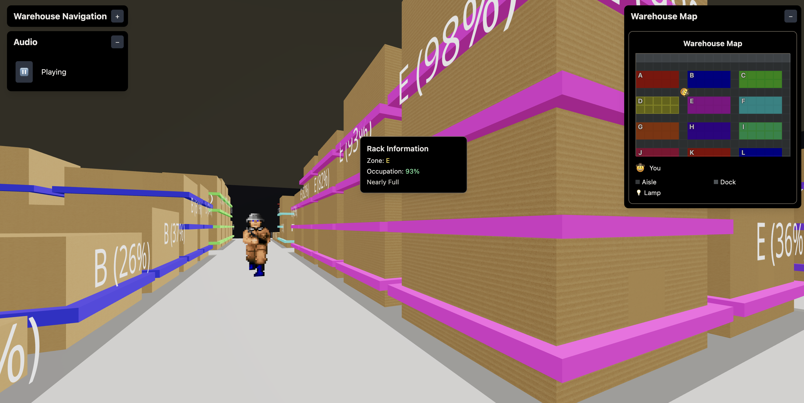
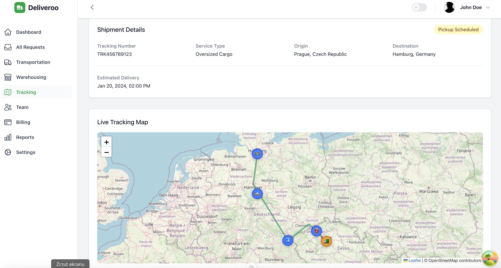

# deliveroo prompts

- assets
  - logo: canva logo generator, ręcznie
  - scenery: GTP4.1 / perplexity

- `tms-frontend-react-lovable`
  - aplikacja `react`/`react-router`, lovable.dev
  - prompt (lovable): see [`PROMPTS-tms-frontend-lovable.md`](./PROMPTS-tms-frontend-lovable.md)

- `wms-d3-visualization-lovable`
  - wizualizacja oparta o d3, zaembedowana w reakta, ale potem przeniesiona do angulara, lovable.dev
  - prompt (lovable): see [`PROMPTS-wms-d3-visualization-lovable.md`](./PROMPTS-wms-d3-visualization-lovable.md)

- `warehouse-3d-simulator-bolt`
  - symulacja 3D wędrowania po magazynie oparta o three.js + react (react-three)
  - prompt (bolt): see [`PROMPTS-warehouse-3d-simulator-bolt`](./PROMPTS-warehouse-3d-simulator-bolt.md)

- `wms-frontend-angular-bolt.zip`
  - aplikacja `angular`/router/tailwind-css, bolt.new
  - prompt (bolt): see [`PROMPTS-wms-frontend-bolt.md`]('./PROMPTS-wms-frontend-bolt.md')
  - kosztowało ~4 mln tokenów (w momencie pisania: bolt darmowo daje 150k/dziennie & 1 mln/mc we free tier)
  - zakres
    - **WSZYSTKIE** zakładki poniżej mają dokładnie zdefiniowane widoki, podwidoki i zakładki
    - usuwanie mocków itp. dzieje się już poza boltem

- opis domeny ([live 16.06.2025](https://discord.com/channels/1368574062263009392/1382246713749934151))
  - eksploracja domeny (pplxt): https://www.perplexity.ai/search/i-want-you-to-generate-10-diff-7VWrXlIzRVeXSHgTZMeYgQ?login-source=oneTapThread&login-new=false
  - podsumowanie (wkładka do fork-wątków): [`THREAD-SUMMARY-logistics-transportation-domain-overview.md`](./THREAD-SUMMARY-logistics-transportation-domain-overview.md)
  - diagramy ER dla domeny (pplxt): https://www.perplexity.ai/search/please-analyze-this-descriptio-KY2oGTffQO6rAdcEmqnpkA

- `customer-portal-bolt`
  - aplikacja `vue`/`nuxt`, bolt.new
  - prompt (bolt): see [`PROMPTS-customer-portal-bolt.md`](./PROMPTS-customer-portal-bolt.md)

- (_ARCHIVED_) `vue-customer-request-portal.zip`
  - aplikacja `vue`/`nuxt`, bolt.new
  - przemigrowana do `nuxt`/`pinia`, w 2 promptach/cursor/llm:auto
  - prompt (bolt): see [`PROMPTS-customer-request-portal-bolt.md`](./PROMPTS-customer-request-portal-bolt.md)
