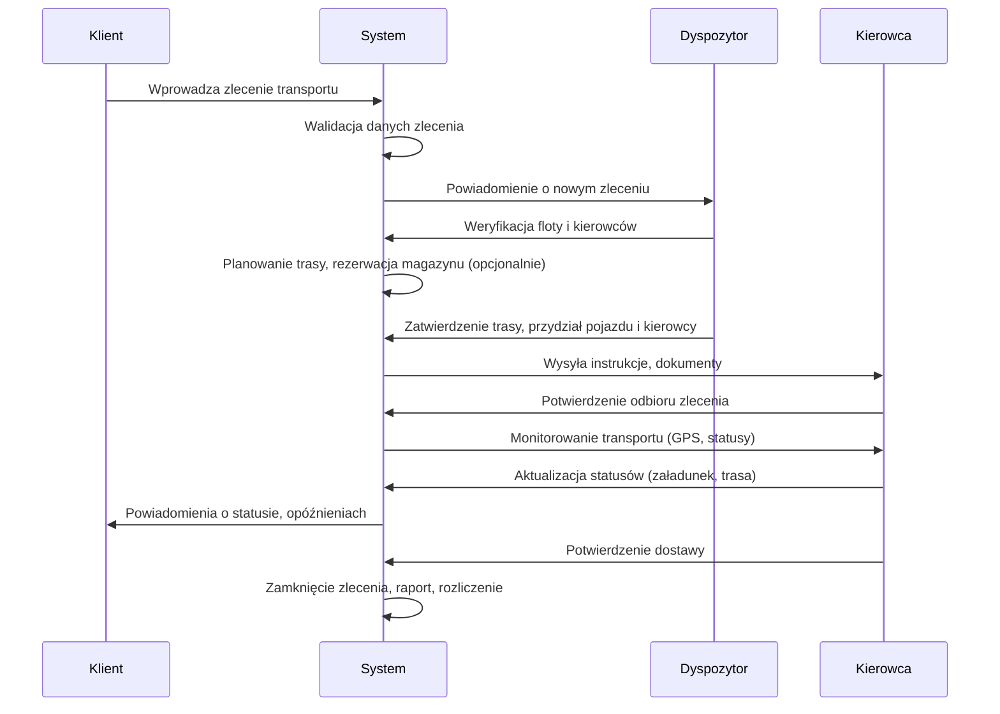
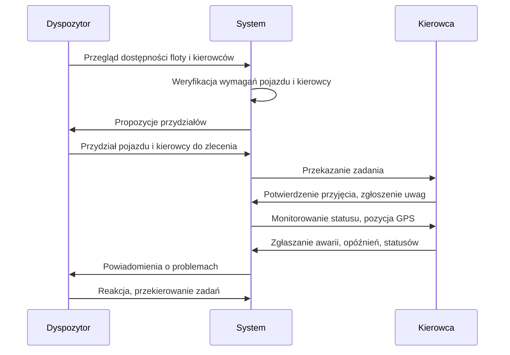
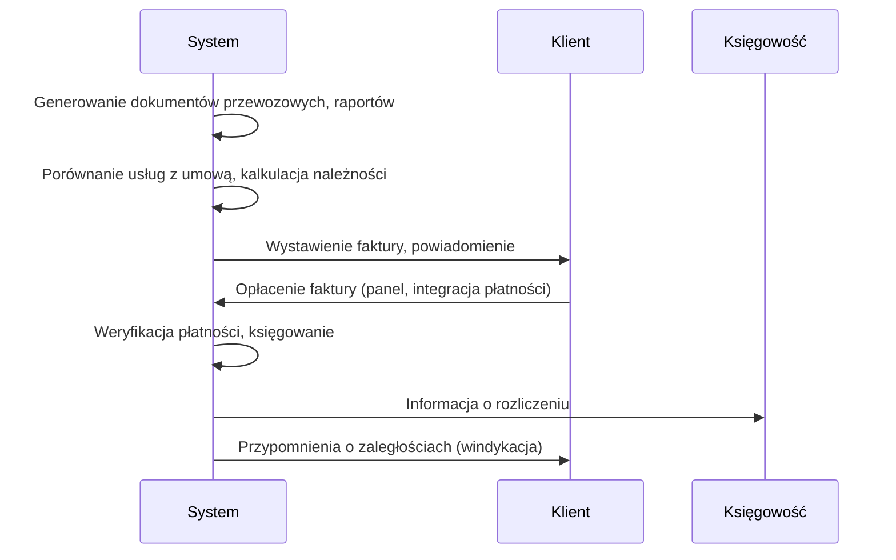

# Główne procesy biznesowe w systemie TMS

## **1. Obsługa zlecenia transportowego (Order-to-Delivery)**

**Opis:** Proces od momentu złożenia zlecenia przez klienta do dostarczenia towaru do odbiorcy.

**Kroki procesu:**

- Klient: Wprowadza nowe zlecenie transportu (dane nadawcy, odbiorcy, towaru, terminy, opcje magazynowania)
- System: Waliduje dane zlecenia (punkty A/B, termin, wymagania)
- Dyspozytor: Weryfikuje dostępność floty i kierowców
- System: Planuje trasę i optymalizuje przewóz (wybór trasy, środka transportu, ewentualna rezerwacja magazynu)
- Dyspozytor: Zatwierdza trasę, przydziela kierowcę i pojazd
- System: Generuje dokumenty przewozowe, przekazuje instrukcje kierowcy
- Kierowca: Potwierdza odbiór zlecenia przez aplikację mobilną
- System: Monitoruje realizację transportu (śledzenie GPS, statusy)
- Kierowca: Potwierdza załadunek, aktualizuje statusy w trakcie trasy
- System: Informuje klienta o postępie i ewentualnych opóźnieniach
- Kierowca: Potwierdza dostarczenie towaru (np. podpis elektroniczny odbiorcy)
- System: Zamyka zlecenie, generuje raport i przekazuje do rozliczenia

**Diagram sekwencyjny (Mermaid):**

---

## **2. Zarządzanie flotą i kierowcami (Fleet & Driver Management)**

**Opis:** Proces efektywnego przydzielania i monitorowania pojazdów oraz kierowców do zleceń transportowych.

**Kroki procesu:**

- Dyspozytor: Przegląda dostępność pojazdów i kierowców (harmonogramy, uprawnienia, statusy)
- System: Weryfikuje zgodność pojazdu z wymaganiami zlecenia (ładowność, ADR, lokalizacja)
- System: Sprawdza czas pracy kierowcy, uprawnienia, zgodność z przepisami
- Dyspozytor: Przydziela pojazd i kierowcę do zlecenia
- System: Przekazuje zadanie do aplikacji kierowcy
- Kierowca: Potwierdza przyjęcie zadania, zgłasza ewentualne uwagi
- System: Monitoruje status pojazdu i kierowcy w czasie rzeczywistym (pozycja, awarie, opóźnienia)
- Kierowca: Zgłasza awarie, opóźnienia, aktualizuje statusy
- Dyspozytor: Reaguje na zgłoszenia, przekierowuje zadania w razie potrzeby

**Diagram sekwencyjny (Mermaid):**

---

## **3. Rozliczenia i płatności (Settlement & Payment Processing)**

**Opis:** Proces rozliczania wykonanych usług transportowych, generowania faktur i obsługi płatności.

**Kroki procesu:**

- System: Po zakończeniu transportu generuje dokumenty przewozowe i raporty
- System: Automatycznie porównuje wykonane usługi z warunkami umowy (stawki, trasy, terminy)
- System: Generuje fakturę dla klienta, udostępnia ją w panelu klienta
- Klient: Otrzymuje powiadomienie o wystawionej fakturze, dokonuje płatności przez panel lub integrację płatności
- System: Weryfikuje wpłatę, automatycznie księguje płatność
- System: Przekazuje informację o rozliczeniu do działu księgowości i dyspozytora
- System: Wysyła przypomnienia o zaległościach, automatyzuje windykację

**Diagram sekwencyjny (Mermaid):**

---

## **Podsumowanie przepływu informacji i aplikacji**

- **Klient** korzysta z panelu klienta do składania zleceń, śledzenia statusów i płatności.
- **Dyspozytor** zarządza flotą i kierowcami przez panel operatorski.
- **Kierowca** używa aplikacji mobilnej do odbioru zleceń, aktualizacji statusów i zgłaszania problemów.
- **System** automatyzuje planowanie, monitorowanie, rozliczenia i powiadomienia, integruje się z zewnętrznymi systemami (GPS, płatności).
- **Księgowość** otrzymuje dane o rozliczeniach i płatnościach.
