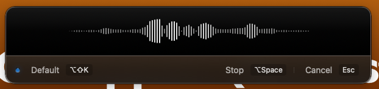
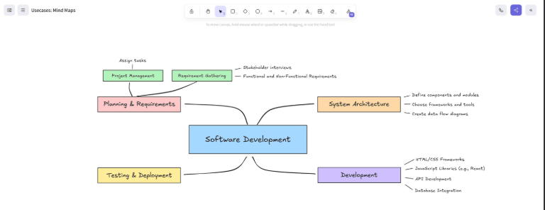
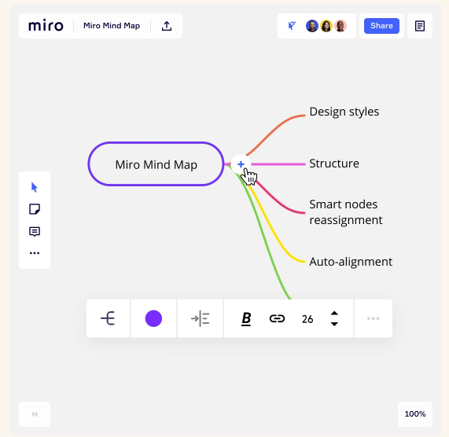
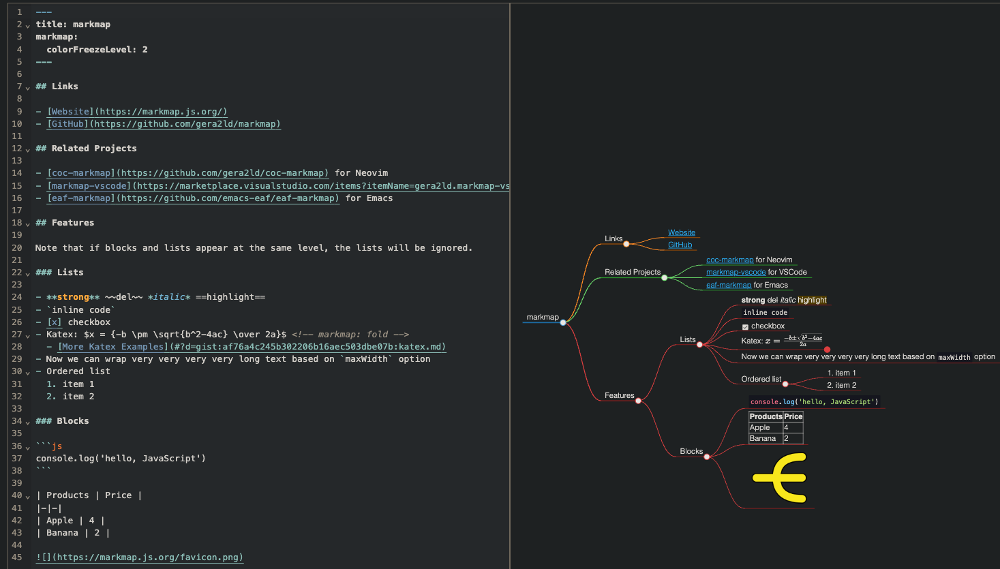
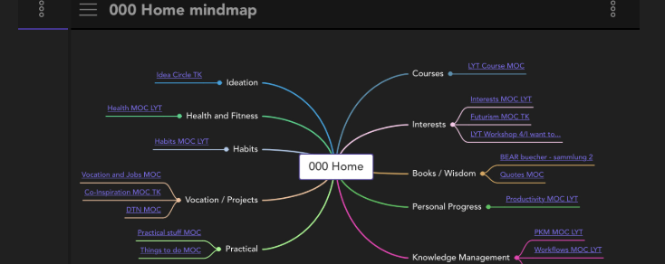

# tooling do mindmap / notatek

## git

- [git jaki jest, każdy widzi](https://pl.wikiquote.org/wiki/Ko%C5%84_jaki_jest,_ka%C5%BCdy_widzi)
  - trzymaj gdzie chcesz, klonuj, historia... po prostu git
- dobry do notatek, ale nie do mindmap

## [text-to-speech: SuperWhisper](https://superwhisper.com/)

- nie pisz wszystkiego ręcznie :) dyktuj!
  - na poziomie UI systemu operacyjnego wybierasz np. edytor tekstu, skrót klawiszowy -> nagrywasz, dyktujesz -> znowu skrót klawiszowy -> masz tekst w edytorze
  - model nieźle łapie interpunkcję
  - zawahania i zwieszki (podczas naturalnego ludzkiego mówienia) są automatycznie "wyprostowywane", +-korekta w locie
  - dyktowanie przez superwhisper np. do perplexity działa _lepiej_ niż natywny "dyktafon" perplexity
- free/PRO
  - free: model anglojęzyczny, bardzo good-enough
  - lepsiejsze modele płatne, w tym nie-anglojęzyczne
  - 15 minut PRO darmowo na zachętę
- mac only (?)
- integracja z LLMami (!)
  - w ramach PRO
  - działanie:
    - dyktujesz
    - tekst przepuszczany do LLMa
    - (możesz dodać custom prompty, cuda wianki)
    - to co trafia do edytora jest odpowiedzią z LLMa
- [TUTORIAL: superwhisper](https://www.youtube.com/watch?v=h_A3bOtyihk)

## [excalidraw](https://excalidraw.com/)

- online edytor, OSS, free
  - offline w formie apki electron
- [VSCode extension](https://marketplace.visualstudio.com/items?itemName=pomdtr.excalidraw-editor)
- GRAFICZNY (textowo nie wyedytujesz)
- import/export do pliku .excalidraw
  - można trzymać w repo
- trzyma dane w LocalStorage przeglądarki (!)
  - istnieje upper limit na rozmiar, ALE raczej go nie osiągniesz ;)
- wyklikując nowy board (np. z poziomu incognito) i współdzieląc masz nowy board z nowym limitem
  - dostajesz unikalny hash (permalink), do tej pory
  - użyteczne jeśli chcesz mieć tematyczne mind mapy
- gdyby ktoś chciał, [można nawet zaembedować](https://www.npmjs.com/package/@excalidraw/excalidraw) we własnym frontendzie
- [TUTORIAL: excalidraw mindmap](https://www.youtube.com/watch?v=JLZVnWwE-H8)

## [miro](https://miro.com/)

- online collab
- 3 boardy za free
- prawd. najpopularniejsze rozwiązanie stosowane przy sesjach event stormingowych
- [TUTORIAL: miro mindmap](https://www.youtube.com/watch?v=PFm3KGGqfsk)

## [markmap](https://markmap.js.org)

- markdown, git-friendly, OSS
- TEXT-BASED
- [online editor](https://markmap.js.org/repl)
- [VSCode extension](https://marketplace.visualstudio.com/items?itemName=gera2ld.markmap-vscode)
- export do HTML
- [MINI-TUTORIAL: markmap mindmap](https://www.youtube.com/watch?v=8MwQtoF2yak)

## [obsidian](https://obsidian.md/) 

- ograniczone features we free tier
  - w płatnym planie sync across devices, collab, etc.
- "vault" - folder na pliki/dokumenty
  - (nie mylić z HashiCorp vault 😉)
  - notatki - markdown-formatted plain text files
  - linkowanie notatek/dokumentów absurdalnie proste
  - linked/unlinked mentions
  - każdy "vault" zarządzany osobno
  - i wiele innych, to cały ecosystem
- bogaty plugin ecosystem
  - [excalidraw plugin](https://forum.obsidian.md/t/excalidraw-full-featured-sketching-plugin-in-obsidian/17367)
    - pozwala embedować pliki Excalidraw w Notatkach
    - pozwala embedować notatki w plikach Excalidraw z "vault"
    - pozwala linkować poszczególne node'y mind mapy do notatek
  - [markmind plugin](https://github.com/MarkMindCkm/obsidian-markmind)
  - i wiele innych
- [TUTORIAL: obsidian mindmap](https://www.youtube.com/watch?v=IVF_x5rdhoo)

(markmind plugin poniżej)

(bo excalidraw plugin to po prostu excalidraw 😉)
