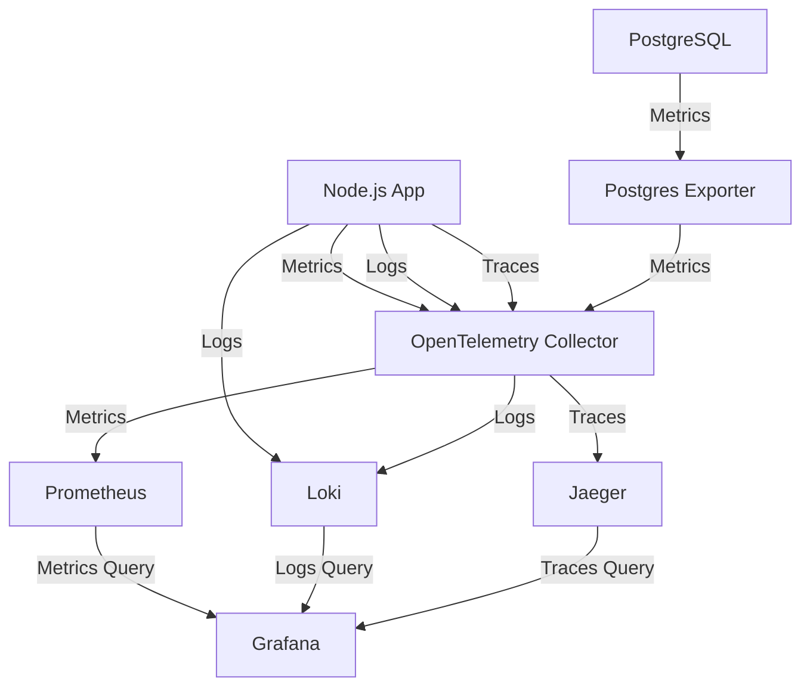
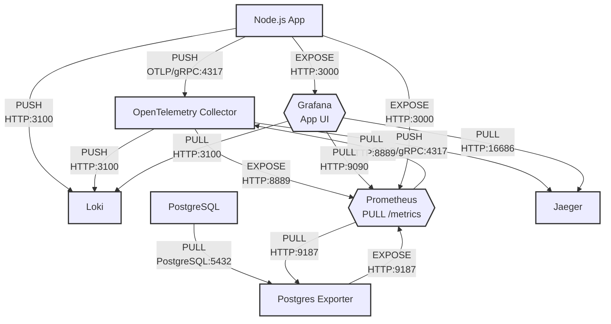

# Node.js App with Complete Observability Stack

This repository contains a Docker Compose setup for a Node.js application with a complete observability stack, including metrics, logs, and traces.

## Architecture

The setup includes the following components:

- **Node.js App**: A simple Express.js application with a /products endpoint that fetches data from PostgreSQL
- **PostgreSQL**: Database for storing product information
- **Prometheus**: Metrics collection and storage
- **Loki**: Log aggregation system
- **Jaeger**: Distributed tracing system
- **OpenTelemetry Collector**: Collects, processes, and exports telemetry data
- **Grafana**: Visualization platform for metrics, logs, and traces

## Telemetry Data Flow



---




## Components and Ports

- **Node.js App**: http://localhost:3000
  - `/products` - Retrieves products from PostgreSQL
  - `/metrics` - Exposes Prometheus metrics
- **Grafana**: http://localhost:3001 (admin/admin)
- **Prometheus**: http://localhost:9090
- **Jaeger UI**: http://localhost:16686
- **Loki**: http://localhost:3100
- **PostgreSQL**: localhost:5432

## Useful Commands

### Start the stack

```
docker-compose up -d
```

### View logs from a specific service

```
# View Node.js app logs
docker-compose logs -f app

# View Grafana logs
docker-compose logs -f grafana
```

### Access the Node.js app and generate telemetry data

```
# Generate metrics, logs, and traces by accessing the /products endpoint
curl http://localhost:3000/products

# View the generated Prometheus metrics
curl http://localhost:3000/metrics
```

### Stop the stack

```
docker-compose down
```

### Stop the stack and remove all volumes

```
docker-compose down -v
```

## Monitoring and Observability

### Grafana Dashboards

The setup includes a pre-configured Grafana dashboard to monitor:

1. HTTP request counts and durations
2. Node.js CPU and memory usage
3. PostgreSQL active connections
4. Node.js application logs

### Logs to Traces

The Loki data source is configured with derived fields to extract trace IDs from logs. This allows you to navigate from logs to traces in Jaeger.

### Traces to Logs

The Jaeger data source is configured to link traces back to logs in Loki, creating a bidirectional relationship.

## How It Works

### Metrics Flow (Pull-based)
- Node.js app exposes metrics at /metrics endpoint
- PostgreSQL metrics are exposed via postgres-exporter
- Both are scraped by Prometheus directly and via the OpenTelemetry Collector
- Grafana queries Prometheus for visualization

### Logs Flow (Push-based)
- Node.js app uses Winston with winston-loki to send logs directly to Loki
- Logs are also sent via OpenTelemetry Collector
- Grafana queries Loki for visualization

### Traces Flow (Push-based)
- Node.js app uses OpenTelemetry to send traces to the OpenTelemetry Collector
- The Collector forwards traces to Jaeger
- Grafana connects to Jaeger for visualization

## Technical Details

### Node.js App
- Uses Express for HTTP server
- Automatically instrumented with OpenTelemetry for Node.js, Express, and PostgreSQL
- Winston for logging with Loki integration
- Prometheus metrics exposed via express-prom-bundle

### PostgreSQL
- Monitored via postgres-exporter for Prometheus metrics
- Used to store product data

### OpenTelemetry Collector
- Central collector for telemetry data
- Routes metrics to Prometheus, logs to Loki, and traces to Jaeger